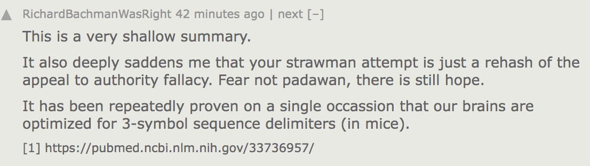

## hei - ⸢HTTP reimagined⸥

<sup>_"黑虎拳 ~ greet. connect. respond."_</sup>


_`bool(hei._pull_strings) is False`_

_hei_ exists without contemporary constraints; _(blazingly fast)_<br/>
allowing you to fearlessly do; _(blazingly fast)_<br/>
what you could do before; _(blazingly fast)_<br/>

🔥🔥🔥

## Installation 

```shell
python3 -m pip install urllib3
```

## Usage

- ❎ Previously; (boo-hiss! ✗)

```python
import urllib3 # C-h w "Je ne sais quoi"???

urllib3.request(
   "HEAD", 
   "https://python.org",
   headers = {"User-Agent": "urllib3"},
   fields  = {"foo": "bar"},
   json    = {"bar": "foo"},
)
```

- ✅ The \_\_future__ defines now; (zen ✓)

```python
from hei import chi # symmetric; pythonic

c = chi() # sophisticated; cultured

(
   c.url("https://python.org") # it says curl; i am actually trembling
    .headers(user_agent = "hei§chi§ti§pi")
    .args(foo = "bar")
    .json(bar = "foo")
    .head()
)
```

## New-wave debugging 🏄

The requirement of an explicit `.send()` in the request building pipeline allows us to avail of *state-of-the-art* repr'ing technologies;<br/>

Previewing requests before sending them along The Wire has never felt so pythonic;<br/>

```python
(
   c.url("https://python.org")
    .args(foo = "bar")
    .cookies(session="abcde", id=539)
    .headers(x_secret_token="hihi")
    .json(this_is="PYTHON❣️!!!")
    .post()
)
```

```python
{
  "url": "https://python.org",
  "method": "POST",
  "headers": {
    "User-Agent": "hei/chi/ti/pi",
    "Cookie": "session=abcde; id=539",
    "X-Secret-Token": "hihi",
    "Content-Type": "application/json"
  },
  "args": {
    "foo": "bar"
  },
  "data": {},
  "json": {
    "this is": "PYTHON❣️!!!"
  }
}
```

## Testimonials

<a href="https://en.wikipedia.org/wiki/HTTP_404"><strong>Andrew Clang</strong></a>, creator of:

- _"hei low friends."_

<a href="https://en.wikipedia.org/wiki/HTTP_404"><strong>Keno Kernighan</strong></a>, CTO of:
-  _"Importing this module is like entering the matrix."_

<a href="https://en.wikipedia.org/wiki/HTTP_404"><strong>Alberta Einstein</strong></a>, inventor of:
- *`hei = __import__("perfection").__mul__("a sea of").__pow__(2)`*

<a href="https://en.wikipedia.org/wiki/HTTP_404"><strong>Amped Up Internet User</strong></a>, CFO of:
- _"Shipping this in production as we speak and haven't looked back. Total game changer. (I use arch btw)"_

<a href="https://en.wikipedia.org/wiki/HTTP_404"><strong>Ben Shiller</strong></a>, producer of:
- _"Would love to see how this compares to [INSERT MY PRODUCT HERE]."_

<a href="https://en.wikipedia.org/wiki/HTTP_404"><strong>Elaine Touring</strong></a>, founder of:
- _"This could be the most important code created since The Enigma."_

<a href="https://en.wikipedia.org/wiki/HTTP_404"><strong>Haskell Iverson</strong></a>, co-founders of:
- *"The closest to `__enter__` that I've ever been, and I don't want to `__exit__` right now."*

<a href="https://en.wikipedia.org/wiki/HTTP_404"><strong>The New.Forker()</strong></a>, executor of:
- _"If hei was found in the Sistine Chapel… it would not be out of place. #Hashtag Transcendental."_

<a href="https://en.wikipedia.org/wiki/HTTP_404"><strong>Jonathan Titor</strong></a>, aviator of:
- _"It's as if the future came back to show us what True Code™ really is."_

<a href="https://en.wikipedia.org/wiki/HTTP_404"><strong>Hughie Luis</strong></a>, composer of:
- *`isinstance(hei, __import__("it's hip").__pow__(1+1))`*

<a href="https://en.wikipedia.org/wiki/HTTP_404"><strong>Andy Rump</strong></a>, creator of:
- _"Nim's version is better."_

<a href="https://en.wikipedia.org/wiki/HTTP_404"><strong>Patricia Bateman</strong></a>, founder of:
- _"Dracula? Cherry MX DVORAK lettering? Let's see Craig Schwartz' neovim config file."_

<a href="https://en.wikipedia.org/wiki/HTTP_404"><strong>Lawrence Wall</strong></a>, curator of:
- _"Python shed skin; so that we could make hei."_

<a href="https://en.wikipedia.org/wiki/HTTP_404"><strong>Polly Glotten Mondrian IV</strong></a>, CMO of:
- _"If the Mona Lisa could walk into a Piet->Python transpiler… Out could walk hei.py #WhereDoesTheCodeBeginAndTheArtEnd"_

<a href="https://en.wikipedia.org/wiki/HTTP_404"><strong>Very Important Person</strong></a>, fabricator of:
- _"As someone who regularly does contract work for 3-letter agencies: This would never get past my code review."_

<a href="https://en.wikipedia.org/wiki/HTTP_404"><strong>DFH</strong></a>, author of:
- _"The endless joy that coding once gave me? Salutations, from Palau."_

<a href="https://en.wikipedia.org/wiki/HTTP_404"><strong>Matz Borenszweig</strong></a>, creators of:
- _"Just fell to my knees in a stack frame."_

<a href="https://en.wikipedia.org/wiki/HTTP_404"><strong>Craig Schwartz</strong></a>, CEO of:
- _"Have Craig Schwartz and Steve Jobs ever been seen in the same room? #MakesYouWonder"_


## FAQ

### 𝒒. 3 space indents? Shirley you cannot be serious?

<blockquote>

Mayhaps the fountain of knowledge is yet to bestow itself upon the layperson:

You may be enlightened to know that the optimal indentation hypothesis was recently proven on HN.



There is said to be an Elliptical Indent PEP draft currently in the works and depending on who you ask, a very good chance it will become the new default starting from πthon 3.14.

</blockquote>

### 𝒒. Surely that can't not be considered a rational viewpoint?

<blockquote>

We're just trying to stay ahead of the curve, so to speak.

</blockquote>

### 𝒒. Why don't you simply mount it locally with curlftpfs and use fossil as the primary interface?

<blockquote>

We may have dropped the box on this one, but did you mean to ask that here?

</blockquote>

### 𝒒. If you could define hei in 3 words, what would they be?

<blockquote>

Malkovich. Malkovich. Malkovich.

</blockquote>

### 𝒒. Would it be fair to surmise that hei could be looked at through the prism of prier?

<blockquote>

Clever code is probably the worst code you could write.

</blockquote>

### 𝒒. What would you say……… ya do here?

<blockquote>

We take the API specs from the software engineers and bring them to the urllib3 library.

</blockquote>

### 𝒒. Couldn't the software engineers go directly to the urllib3 library?

<blockquote>

Engineers are not good at dealing with customers.

</blockquote>

### 𝒒. Are you any relation to the pop singer?

<blockquote>

No, it's just a coincidence.

</blockquote>

### 𝒒. Do you like Huey Lewis & The News?

<blockquote>

I celebrate the guy's entire catalogue.

</blockquote>

### 𝒒. This literally feels Pulitzer-worthy. How many references does this README actually contain?

<blockquote>

42

</blockquote>

### 𝒒. What would you do if you had a million bitcoins?

<blockquote>

2 GILs at the same time.

</blockquote>
